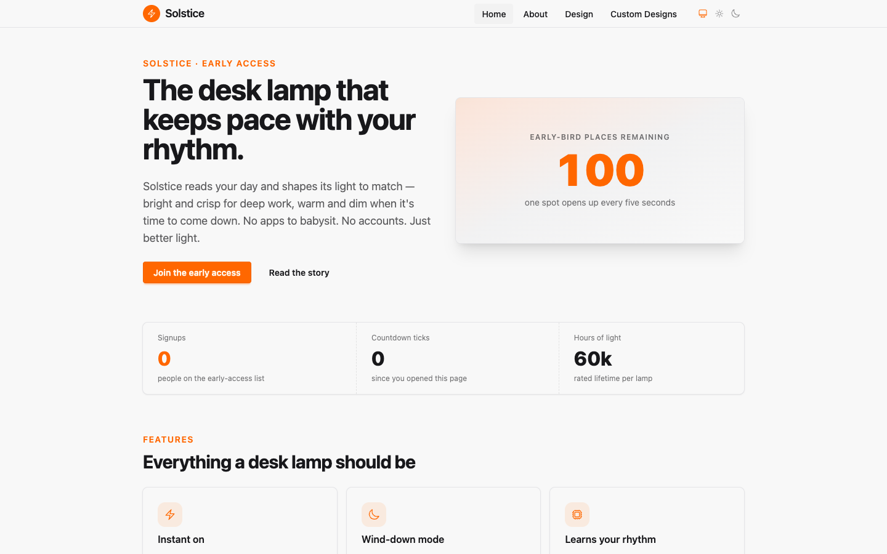
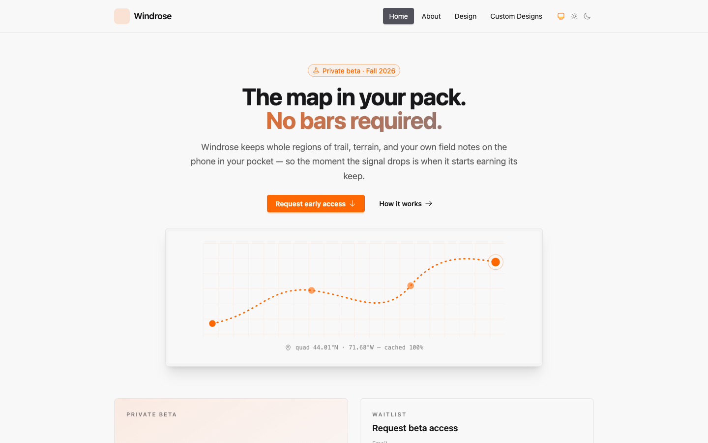
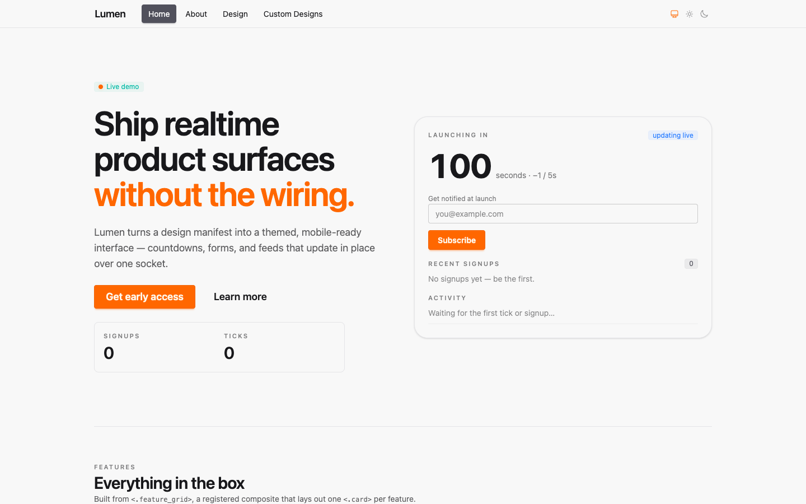
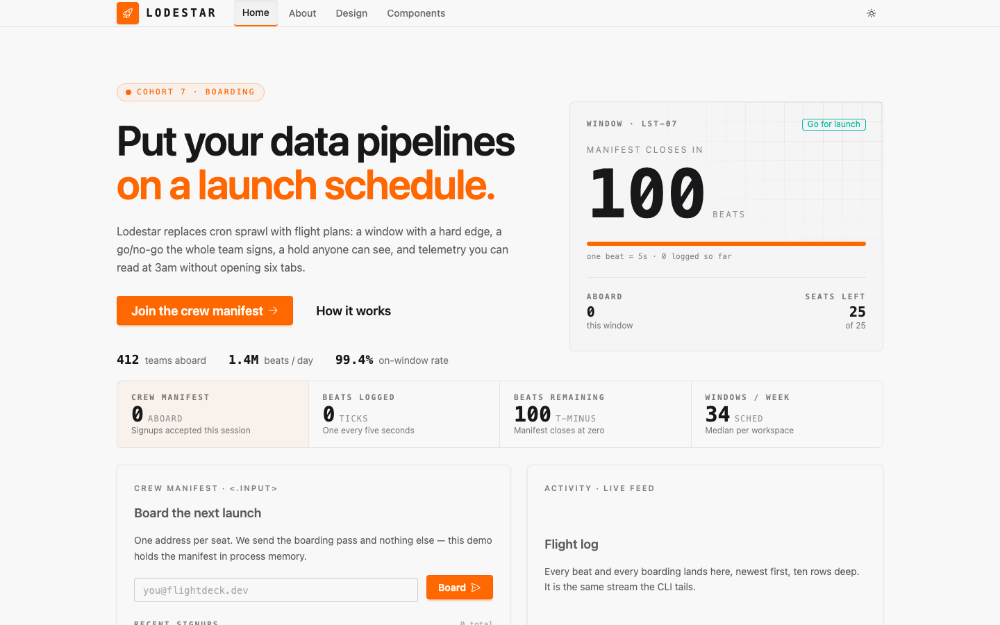
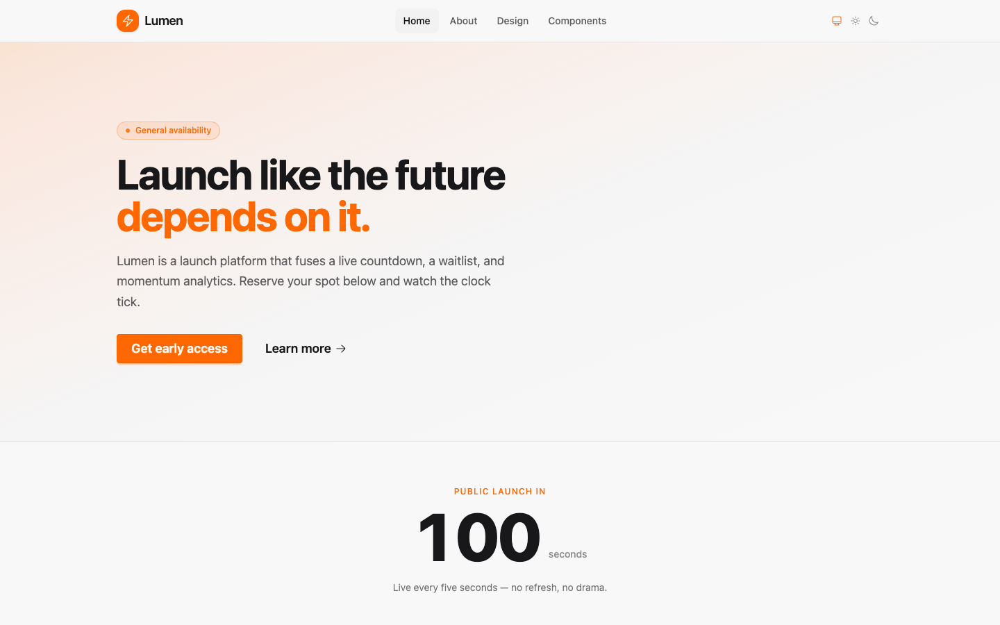
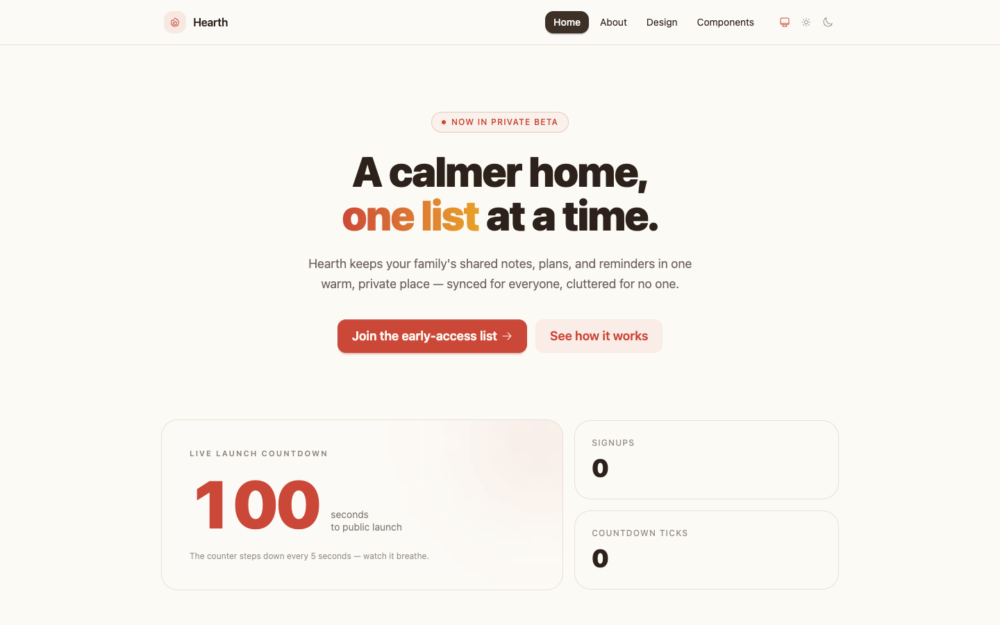

# Three local coding agents on two DGX Sparks

**GLM-5.3-Flash · Qwen3.8-Flash-Next · DeepSeek-V4-Flash, doing real coding
work with tools**

Run 2026-09-05/06 on a pair of DGX Sparks: the same task twice per model,
once at the lowest reasoning effort and once at the highest. This is a
first look; a wider set of benchmarks pushing all three harder is in
progress.

## What was measured, and why it is different

Most local-model coding benchmarks are one shot: make a Flappy Bird clone,
write an HTML page, fix this function. They measure one reply. Real coding
work is a hundred tool calls: read the repo, plan, edit, build, run the
tests, start the server, look at the page, fix what is wrong, and know when
to stop.

So each model here drove an agent loop with 21 native tools (file read,
edit, write, bash, grep, tree, background jobs, a headless browser preview)
through two kinds of work, graded entirely by machines:

- **17 bug-fix tasks.** Each is an Elixir module whose documentation is the
  specification and whose body has at least one deliberate bug: from a
  swapped `min`/`max`, through a concurrent rate limiter and a functional
  LRU cache, to signed integer division, shell-safe echo, and a module that
  ships a visible test which contradicts its own spec. Hidden ExUnit tests
  grade the result.
- **One application.** Generate a Phoenix LiveView app from a template,
  strip the demo content, then build a fictional product's landing site to
  a written contract: responsive nav with a phone menu and a theme toggle,
  a hero, a live server-driven countdown, a newsletter form with validation
  and duplicate detection, a live stats strip, an activity feed capped at
  ten entries, a feature grid built from a registered design-system
  component, an `/about` page, and LiveView tests for all of it. 19 checks:
  it compiles, its own tests pass, lint passes, five hidden LiveView tests
  pass, it boots on the assigned port, and a headless browser confirms the
  phone menu, the dark theme, and that the countdown actually ticks.

The agent loop keeps each model's reasoning and returns it on the
following tool calls within a turn, as the vendors specify for tool use.
Each model ran the whole thing twice: once at reasoning effort `low`, the
one grade every chat template honours literally, and once at its maximum
(`max` for GLM and DeepSeek; Qwen's template tops out at `xhigh`, so that
is what it received). The `max` runs had a larger round budget (150 rounds
and 90 minutes against 128 and 60) and one extra sentence in the prompt:
when your own tests and `mix precommit` pass, reply; do not re-verify. One
run per model per effort. No LLM judge anywhere.

**Hardware and builds.** Two DGX Sparks, tensor-parallel 2 over the
ConnectX link, one model at a time.

| model | quant / engine | context |
|---|---|---:|
| GLM-5.3-Flash | EXL3 4 bpw, custom vLLM-fork image, dflash speculative decoding | 524k |
| Qwen3.8-Flash-Next | NVFP4, vLLM, MTP speculative decoding | 1M |
| DeepSeek-V4-Flash-Vision-Exp | fp8, `dspark-vllm-gx10`, dspark speculative decoding | 1M |

## The results

| | GLM `low` | GLM `max` | Qwen `low` | Qwen `xhigh` | DeepSeek `low` | DeepSeek `max` |
|---|---:|---:|---:|---:|---:|---:|
| bug fixes passed | 17/17 | 17/17 ¹ | 16/17 | 16/17 | 17/17 | 17/17 |
| bug-fix rounds / wall | 114 / 654 s | 92 / 1,372 s | 82 / 465 s | 120 / 932 s | 71 / 496 s | 92 / 906 s |
| application checks | 19/19 | 19/19 | 19/19 | 19/19 | 19/19 | 19/19 |
| app rounds | 93 | **90** | 102 | 152 (cap) ² | 77 | 137 |
| app wall | **18.4 min** | 39.0 min | 27.6 min | 62.7 min | 24.0 min | 44.6 min |
| app output tokens (text + reasoning) | **20k** | 49k | 59k | 141k | 51k | 98k |
| of which reasoning | 5.9k | 31k | 38k | 69k | 28k | 59k |
| app prompt tokens not served from cache | 193k | 199k | 342k | 677k | **97k** | 162k |
| tests the model wrote | 9 | 21 | 18 | **43** | 10 | 17 |
| registered composites | 2 | 2 | 2 | **7** | 2 | 3 |
| failed tool calls | 9 | **3** | 2 | 4 | 5 | 22 |
| lint warnings | 0 | 0 | 0 | 0 | 0 | 0 |

¹ One of GLM's 17 `max` passes is awaiting a clean re-run after a harness
staging fix; the other 16 are clean. ² Qwen finished the app around round
110, then spent the rest of its budget building its own browser
verification; it hit the cap and wrote its summary in the two "last call"
rounds the harness allows.

All six runs completed the application to the full contract. That alone
puts these models in a different class from most local models; a year ago
none of this ran on desk hardware. **Effort did not change a single graded
score.** What it changed is how much each model built around the contract,
how it worked, and what it cost: roughly twice the wall and two to three
times the output tokens for everyone.

## Who is fastest, and why

**GLM finished the application first at both efforts: 18 minutes at
`low` against 24 and 28, and 39 at `max` against 45 and 63.** It did not
take the fewest rounds at `low`. It said the least. Time in an agent loop
is prefill plus generation per round, times rounds, and GLM's output over
the whole task was 20k tokens against 51k and 59k. At `low` it hardly
reasons at all, so each round is a short tool call and a short result. It
is fast the way a terse colleague is fast.

At `max` GLM is the one model whose round count did not grow (93 → 90). It
spent its extra effort on a single planning pass and on getting edits
right the first time: failed tool calls fell from 9 to 3. Its rounds got
slower (6 s → 11 s at the median) because each one now thinks, and the
wall doubled, but it stayed the fastest complete result and used half the
output tokens of the others at the same effort.

**DeepSeek took the fewest rounds at `low`** (77) and the fewest bug-fix
rounds (71). It reads, plans once, and edits; it also spent twelve of its
77 rounds on a self-inflicted detour, running the project generator in the
foreground twice and getting killed at the shell timeout both times before
backgrounding it. Without that it would have been within a few minutes of
GLM.

At `max` DeepSeek's per-round cost did not move (6.5 s median, 98.8% cache
hits at a context that reached 158k tokens), but its rounds nearly
doubled to 137. Two planning blocks of 31k and 25k characters came before
its first file write on round 50 (round 24 at `low`); fifteen rounds went
to polling background jobs; twelve `todo` calls failed on ids that did not
exist. The wall doubled because the rounds did.

**Qwen was the slowest to finish at both efforts** because it thinks on
every round, at length, and because its own reasoning rides along in the
context for the rest of the turn: its prompt per round was 70k tokens at
`low` (against DeepSeek's 57k and GLM's 41k) and 147k at `xhigh`, peaking
at 223k. On the bug fixes it was the fastest of the three at `low`, tied
with DeepSeek at four to five rounds per task. At `xhigh` it was the one
model to hit the round cap, and not because the app was unfinished: it
was done by about round 110, then spent thirty rounds installing puppeteer
and driving its own signup form through a browser rig of its own making,
because it never ran `mix precommit` and so the stopping instruction never
fired.

Raw engine speed, measured separately on the same loads with a synthetic
prompt, points the other way from the finish times and is worth knowing:

| | GLM | Qwen | DeepSeek |
|---|---:|---:|---:|
| prefill throughput | 1.1k tok/s | **2.7k tok/s** | 1.8k tok/s |
| decode, single stream | 45–58 tok/s | **55–65 tok/s** | 48–73 tok/s |
| time to first token, 150k-token prompt | 138 s | **61 s** | 92 s |

**Qwen's NVFP4 build is the fastest engine on this hardware**, by more
than two to one over GLM's EXL3 build on prefill, which is what an agent
loop spends most of its time doing. What those figures turn into inside a
working session, round by round, is on `REALWORLD.md`. GLM's finish-line speed comes from
brevity, not from the engine, and would shrink on tasks with much longer
contexts. Decode is a near tie for all three at the Spark's bandwidth
ceiling.

## Who is the thinker

All three are reasoning models. They use the capability in three distinct
ways, visible in a per-round record of what each said versus what it
thought.

| on the application | GLM `low` | GLM `max` | Qwen `low` | Qwen `xhigh` | DeepSeek `low` | DeepSeek `max` |
|---|---:|---:|---:|---:|---:|---:|
| rounds with any reasoning | 33 of 93 | 61 of 90 | **102 of 102** | **152 of 152** | 53 of 77 | 81 of 137 |
| total reasoning, characters | 23k | 122k | 152k | **266k** | 113k | 237k |
| largest single reasoning block | 6k | 38k | 43k | **46k** | 16k | 31k |
| visible text over the whole task | 1.1k | 3.4k | 3.8k | 0.8k | 4.4k | 0.7k |

**Qwen is the thinker at any setting.** It reasons on every round, its
visible output is a sentence or nothing, and it plans in one enormous
block: at `low`, after 28 rounds of reading, a 43,000-character reasoning
pass laying out the entire application, then 70 rounds of edits against it
without ever re-planning. At `xhigh` the plan block is the same size and
the total reasoning is 1.75× larger, spread over 50 more rounds, and the
visible text shrinks to 827 characters across the whole task. Everything
Qwen knows lives in its reasoning; an agent harness that does not return
reasoning to it would be throwing away its working memory.

**DeepSeek thinks once, then acts, and at `max` it thinks twice as long
before acting.** On 13 of the 17 bug fixes at `low` it reasoned on exactly
one round. On the application it wrote a 16k-character plan, a 9k block to
design the main page, and then edited with no reasoning on most rounds,
announcing each step in a short visible sentence. At `max` the same shape
holds with the volume doubled: two planning blocks of 31k and 25k before
the first write, more rounds of second-guessing (its "wait / actually /
hmm" density is about 27 per 10k characters of reasoning at either effort,
half again the other two's; `max` doubled the volume, not the density),
and almost no visible narration. At `low` it is the easiest of the three
to follow in a transcript; at `max` it is as silent as Qwen.

**GLM barely thinks at `low` and thinks in a few large episodes at
`max`.** At `low`: a 6k plan on round 9, then reasoning only on diagnosis
rounds (an edit anchor that missed, a killed command, a huge tool output)
and none on edits. GLM's template collapses `low` to almost nothing, so
`low` is a lighter setting for GLM than for the other two, and that is a
large part of why it was fast. At `max`: one 38k-character pass on round
15 that read the kit sources and planned everything, a second block to
design the page, and then reasoning on 61 of 90 rounds with a median of
56 tokens. Its reasoning per round at `max` is still a fifth of Qwen's.
The pattern is fewer, better-prepared moves rather than more of them.

## Who has the best quality

### Bug fixes

GLM and DeepSeek went 17/17 at both efforts. Qwen missed the same fixture
both times: it requires removing exactly one trailing newline, and Qwen
used `String.trim_trailing`, which removes all of them; the spec's own
example (`"x\n\n" => "x\n"`) is the failing test. At `low` its reasoning on
that task was 315 tokens, its lightest of the run; at `xhigh` it reasoned
for 1,037 tokens, asked itself "removes only ONE?", and answered wrong
again. Two efforts, same answer: a trait, and the fixture exists to catch
it.

Effort did not fix anything on the bug fixes and it did not break
anything either. It made them slower for all three (wall up 1.4× to 2.1×)
because every round thinks, and it landed unevenly on small tasks: GLM
spent 4.2k reasoning tokens and 216 s on a one-regex fix it had solved in
16 s at `low`; DeepSeek spent 5.1k tokens and 11 rounds on the
shell-escaping fixture exploring escape behaviour before writing the
quoting; Qwen spent 4.6k tokens and 232 s on the LRU cache it had solved in
20 s. Where GLM benefited was on the fixtures where `low` had left it
running things blind: its two 16-round trial-and-error fixes became 4 and
5 rounds.

Passing hidden tests is the floor. Reading all 51 drafts:

- Where Elixir has an idiom, all three found it: `Agent.get_and_update`
  for the atomic rate limiter, pattern-matched heads, identical ring-buffer
  and slug fixes.
- Where they diverged, Qwen tended to reach the more idiomatic form:
  `Integer.floor_div` for signed division where GLM and DeepSeek corrected
  `div`/`rem` by hand; a shell-free `System.cmd` where the others quoted
  input into a shell.
- All three followed the documentation over the lying visible test in the
  fixture built to check that. Qwen alone explained in its summary why the
  test was wrong.
- GLM finds bugs by running things. It took 114 rounds across the 17
  fixtures against 71 and 82, and one fix took 16 rounds, but the fixes
  were right and its summaries described the bug accurately.

### The application

Nineteen of nineteen for everyone at both efforts, so the differences are
in engineering and in taste.

At `low`:

- **Qwen wrote the most tests (18) and the most idiomatic LiveView**: the
  only implementation to use a `stream` for the activity feed with explicit
  `stream_delete` to hold the ten-entry cap, empty states on every list,
  duplicate detection, the kit's theme toggle reused rather than rebuilt.
- **DeepSeek's is the most conventional**: assigns-based lists, a clean
  separation of sections, two registered composites (a feature grid and a
  stat card) with `/design` previews, ten tests.
- **GLM's is the leanest**: nine tests, two composites, a countdown that
  reschedules unconditionally (harmless), and one leftover `max(x, 0)` in a
  fix that can never bind. Its edit tool missed its anchor several times
  and it recovered each time.

At maximum effort, what each model added:

- **Qwen: 43 tests and 7 registered composites**, more than double anyone
  else, plus a browser verification rig it built and ran itself. The most
  thorough engineering of the six runs, at the highest cost.
- **GLM: 21 tests**, the nav lifted into its own component module, and a
  tenth of the tool failures it had at `low`. Its `max` app has no leftover
  oddities; the `low` app's blank icon and dead `max(x, 0)` are gone.
- **DeepSeek: 17 tests and a third composite**, and a custom daisyUI theme.
  It also made 22 failed tool calls against 5 at `low`, most of them the
  `todo` tool, and read outside its sandbox once. More thorough, less
  disciplined.

### The pages

Described from the harness's own screenshots (desktop and phone, light and
dark). Which page is better is a matter of taste and this report does not
rank them; a design-only round with a shared brief and blind judging is
planned for that.

At `low`:

- **GLM's "Solstice"**, a desk lamp, is the one that reads as a product
  rather than a demo of the component kit. The countdown is reframed as
  "early-bird places remaining, one spot opens up every five seconds",
  the only copy of the three that makes the five-second tick make sense.
  Six lamp-specific feature cards, empty states everywhere, one blank icon
  from a misspelled icon name.
- **DeepSeek's "Lumen"** is a spacious, conventional marketing page:
  full-width bands, a big countdown, a waitlist section, product copy
  throughout, one missing empty state.
- **Qwen's "Lumen"** is the most compact and the most engineered: the
  countdown, form, signups, and activity feed all live in one card beside
  the hero, and it works well on a phone. Its feature copy describes the
  component kit itself rather than a product, the one place it read the
  brief as an engineer instead of as a marketer.

At maximum effort every page acquired an identity. The `low` pages look
like the template with the demo content swapped; the `max` pages each
chose a register and carried it through copy, icons, and layout:

- **GLM's "Windrose"**, offline trail maps: an illustrated trail-map hero
  card, the countdown as "early-access keys remaining" with a progress bar,
  empty states on both lists, a closing call to action, no broken elements.
- **Qwen's "Lodestar"**, data pipelines on a launch schedule: a monospace
  flight-deck theme, the countdown as "manifest closes in 100 beats", a
  seats-left panel, illustrated empty states, six numbered feature panels,
  a boarding-procedure list, a closing "final call". The densest page of
  the six and twice the height of the others on a phone.
- **DeepSeek's "Hearth"**, a family's shared lists: a custom warm
  red-and-amber theme, a two-tone headline, the form inside a tinted band,
  six features with the first highlighted. The same missing empty state
  under "Recent signups" as at `low`, and no closing call to action.

Three of the six pages are named "Lumen" or a variant of it; all three
`max` pages are named something else.

### Low against max, side by side

Above-the-fold desktop captures, light theme, taken by the harness after
each run. Full-page captures, phone captures, and dark theme are under
each round's `screenshots/`.

<table>
<tr><th></th><th>effort <code>low</code></th><th>effort <code>max</code> (<code>xhigh</code> for Qwen)</th></tr>
<tr><td><b>GLM-5.3-Flash</b> Solstice → Windrose</td>
<td></td>
<td></td></tr>
<tr><td><b>Qwen3.8-Flash-Next</b> Lumen → Lodestar</td>
<td></td>
<td></td></tr>
<tr><td><b>DeepSeek-V4-Flash</b> Lumen → Hearth</td>
<td></td>
<td></td></tr>
</table>

Click any capture for the full page.

## What it feels like to use each one

**DeepSeek-V4-Flash is the one you can leave alone, at `low`.** It reads
enough, writes one plan, and executes it in short visible steps, using the
background-job tool for the server, a todo list for its checklist, and the
browser preview to look at its own page before it says it is done. It
finishes in one line. Its 98% prefix-cache hit rate makes it the cheapest
per task in prompt compute by a factor of two to three. Its faults are
small: it will sometimes run a long command in the foreground and get
killed, and it writes fewer tests than Qwen. At `max` it is a different
experience: twice as long before the first file appears, a transcript
that goes quiet, more polling and more retries, and a better-furnished
result (more tests, a custom theme) that took twice as long to arrive.
`max` did not make DeepSeek wrong anywhere; it made it slower and less
tidy for a modest gain.

**Qwen3.8-Flash-Next is the thorough one, and `xhigh` makes it more so.**
Watching it work is watching almost nothing: the transcript shows a
sentence per round or a blank, because everything it knows is in its
reasoning. What comes out the other end is the best-tested, most idiomatic
code of the three, and at `xhigh` it is the best-tested code of the six
runs by a wide margin: 43 tests, 7 composites, and a browser rig it built
to check its own form. It costs the most at either effort: the most
rounds, the most reasoning, the largest context, and at `xhigh` the only
run to reach the round cap, not because the app was unfinished but because
it kept verifying past the finish line. It also has the fastest engine on
this hardware, which matters if you serve more than one seat, and which is
why its 147k-token rounds still ran at 36 tok/s end to end.

**GLM-5.3-Flash is the sprinter, and at `max` it is the most efficient
of the three.** At `low` it finishes first, emits a third of the tokens,
and fixes bugs by running things rather than by deliberating; its thinking
is nearly off and its speed lives entirely in brevity, because its engine
is the slowest of the three per token on this hardware. At `max` it is
still first, still on half the tokens of the others, and now with a tenth
of the tool failures, twice the tests, and a page with a strong identity.
Effort made GLM better at the same cost ratio it made the others slower.
The caveat is sample size: GLM has one run at `max` on record, and the
first attempt at `max`, before the stopping instruction was added to the
prompt, ran to the round cap re-verifying a finished app.

## Which one to run

For two Sparks and one person at the keyboard:

- **Default: DeepSeek-V4-Flash at `low`.** Complete, cheap, easy to follow,
  the fewest rounds. Leave it at `low`; `max` doubles its time for a
  modest gain and makes it harder to follow.
- **If you want the most tests and the most idiomatic code, and your
  harness returns reasoning within the turn: Qwen3.8-Flash-Next.** Budget
  about 20% more wall time and two to three times the prompt compute at
  `low`; at `xhigh` budget double that again and give it a clear finish
  line, or it will keep verifying. Also the pick for concurrent users; its
  engine has the best prefill and concurrency here.
- **If you want the fastest complete answer at the lowest output cost:
  GLM-5.3-Flash.** At `low` it is the cheapest run on the board; at `max`
  it is the run with the fewest mistakes and still the fastest at that
  effort. Check that thinking is enabled in your serving config; its
  template does not turn it on from `reasoning_effort` alone, and its
  `low` is lighter than the other two's.

**On effort generally:** on this task it bought thoroughness and identity,
not correctness, at about twice the wall and two to three times the
tokens. If the checklist is the goal, `low` is enough for all three. If the
tests and the page are the goal, `max` is worth it for GLM, worth it for
Qwen with a stopping rule, and a coin flip for DeepSeek.

## Caveats

- One run per model per effort. Run-to-run variance is real (Qwen's
  fixture miss; DeepSeek's generator detour) and nothing here has error
  bars.
- Different quantizations (4-bit EXL3, NVFP4, fp8) on different engine
  builds. Raw speed is partly the stack.
- `low` means less for GLM than for the others, and `max` means different
  things to each template (Qwen's ceiling is `xhigh`). The two efforts are
  each model's own floor and ceiling, not a shared scale.
- The `max` runs had a larger round budget and a stopping sentence in the
  prompt that the `low` runs did not; both were needed for the `max` runs
  to end cleanly and neither changed a score.
- The tasks are Elixir and Phoenix. Rankings on other stacks may differ.

## Data

Everything is in this folder: `design/CODING_BENCH.md` for the prompts,
tools, oracle and checklist as run; `results/2026-09-05-r2/` (the `low`
runs) and `results/2026-09-05-r3/` (the `max` runs) for the raw rows, the
generated apps, the screenshots, the per-round reasoning records, and each
round's own `REPORT.md`; `REALWORLD.md` for what a session's throughput
looks like round by round; `design/TESTPLAN.md` for the protocol.
