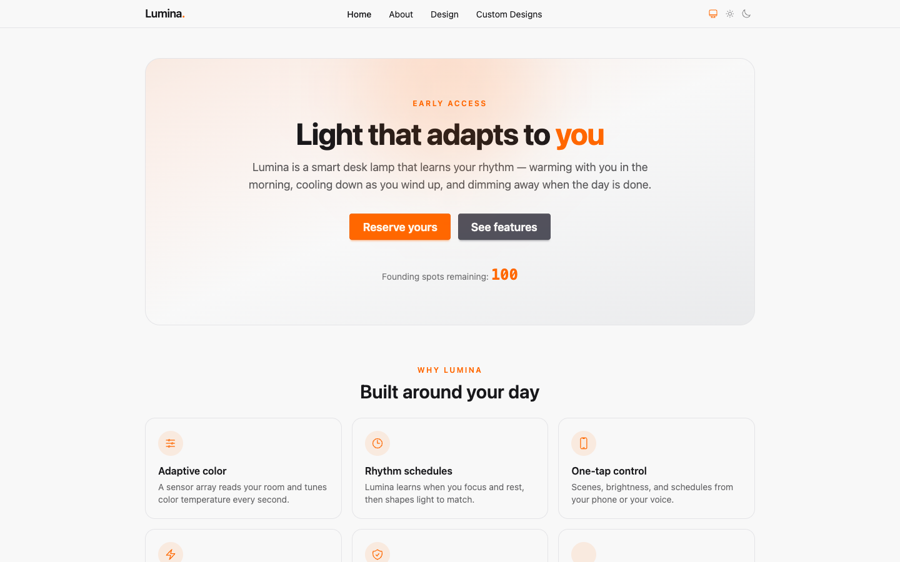
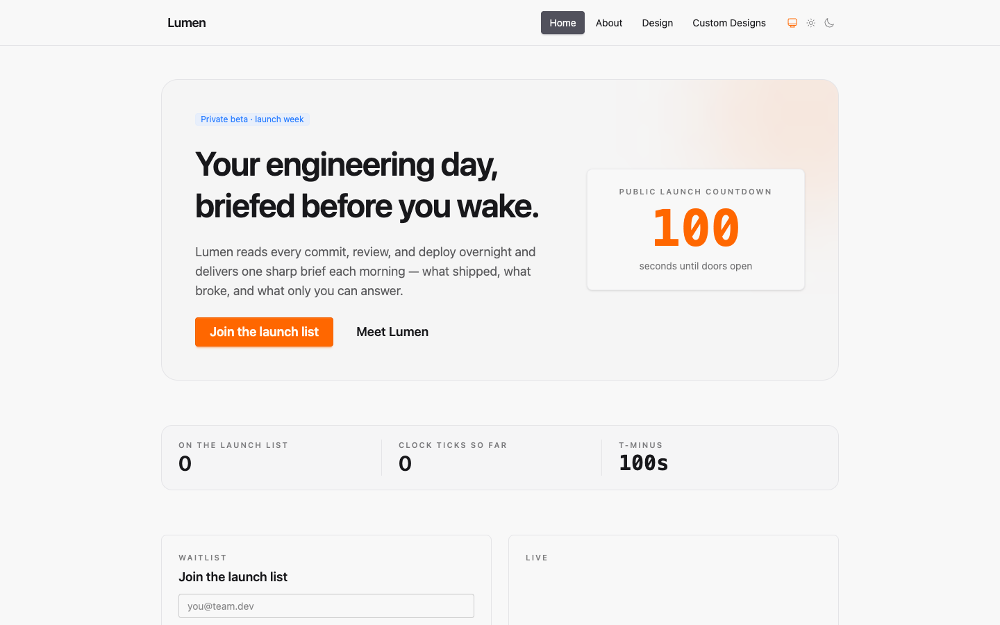
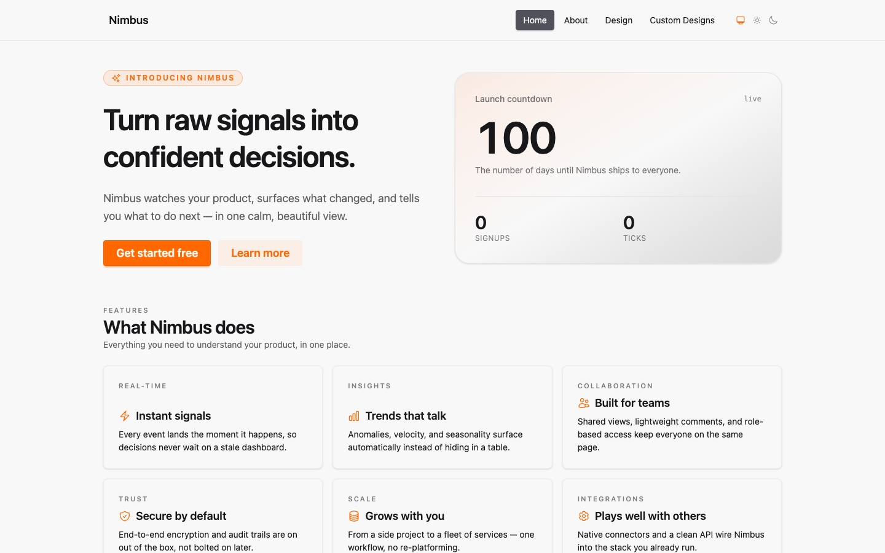
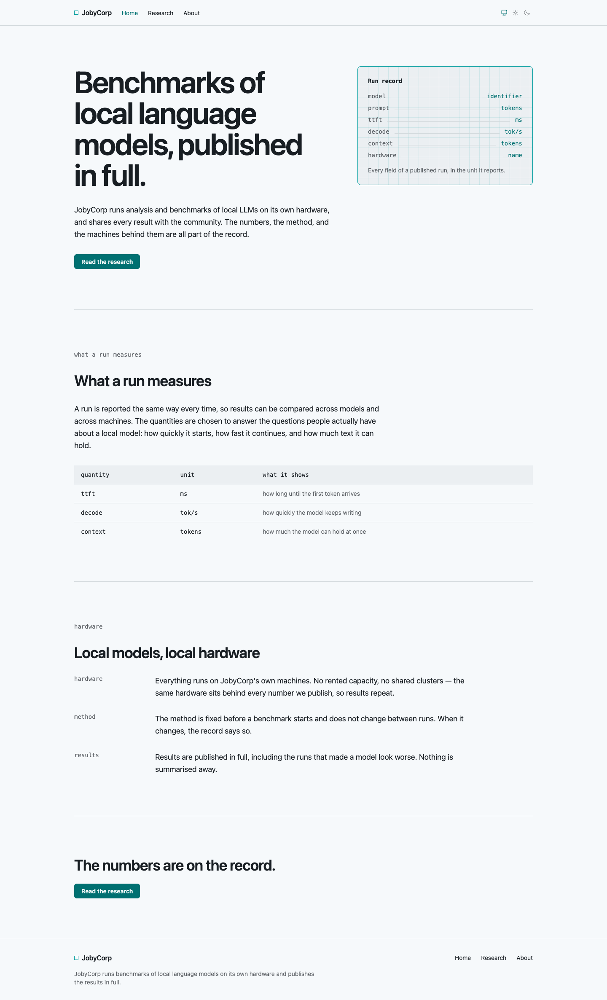
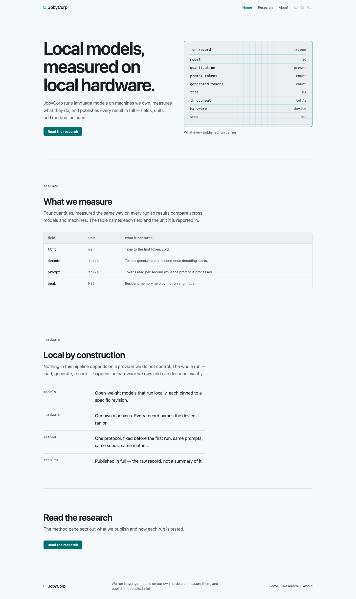
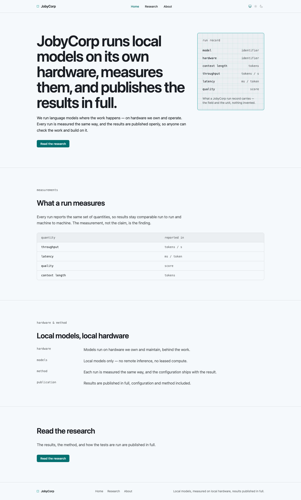

# Three local coding agents on two DGX Sparks

**GLM-5.3-Flash · Qwen3.8-Flash-Next · DeepSeek-V4-Flash, doing real coding
work with tools**

The baseline round, `2026-09-10-baseline`, run on 2026-09-11 UTC on a pair
of DGX Sparks: every model through the same five benches on one harness,
at reasoning effort `low`, one session per task, three runs per model for
throughput. This round supersedes the earlier ones, which stay under
`results/` as history: the harness they ran on changed in ways that make
their rows non-comparable, and nothing here is quoted from them.

## What was measured, and why it is different

Most local-model coding benchmarks are one shot: make a Flappy Bird clone,
write an HTML page, fix this function. They measure one reply. Real coding
work is a hundred tool calls: read the repo, plan, edit, build, run the
tests, start the server, look at the page, fix what is wrong, and know when
to stop.

So each model here drove an agent loop with 18 native tools on the wire
(file read, edit, write, bash, grep, structural grep, glob, tree, outline,
background and server jobs, a headless browser it can look at and drive,
a todo list) through four kinds of work, graded entirely by machines, and
one raw-throughput bench:

- **17 bug-fix tasks.** Each is an Elixir module whose documentation is the
  specification and whose body has at least one deliberate bug: from a
  swapped `min`/`max`, through a concurrent rate limiter and a functional
  LRU cache, to signed integer division, shell-safe echo, and a module that
  ships a visible test which contradicts its own spec. Hidden ExUnit tests
  grade the result.
- **A Phoenix application.** Generate a LiveView app from a template, strip
  the demo content, then build a fictional product's landing site to a
  written contract: responsive nav with a phone menu and a theme toggle, a
  hero, a live server-driven countdown, a newsletter form with validation
  and duplicate detection, a live stats strip, an activity feed capped at
  ten entries, a feature grid built from a registered design-system
  component, an `/about` page, and LiveView tests for all of it. 19 checks:
  it compiles, its own tests pass, lint passes, hidden LiveView tests pass,
  it boots on the assigned port, and a headless browser confirms the phone
  menu, the dark theme, and that the countdown actually ticks.
- **A JavaScript application.** The same landing-site contract on a
  generated Vite + React + TypeScript app, graded by six checks: it
  builds, it typechecks, the demo is gone, components live in their own
  files, a hidden vitest suite of 14 tests passes, and the model's own
  tests pass.
- **A design brief.** The JobyCorp website, three pages in both themes at
  both widths, from one brief and one design direction (`design/DESIGN.md`)
  on a byte-identical base. 19 mechanical gates: compile, tests, lint, demo
  gone, routes, current-page marking, no overflow at 390 px, WCAG AA
  contrast on every text element in both themes, icons resolve, copy free
  of kit and task words, the theme pair in place, a registered composite
  used on two pages, boots, mobile nav, theme toggle, dark theme. A blind
  rubric review ranks the sets; it has not yet been run on this round.
- **Throughput.** Decode, prefill and time to first token on real output
  kinds, thinking off, three runs per model, with the published benchmark
  cells run verbatim beside them. `THROUGHPUT.md`.

The agent loop keeps each model's reasoning and returns it on the
following tool calls within a turn, as the vendors specify for tool use.
Tool results arrive verbatim under a window-scaled ceiling; images ride
the model's own wire; every request ends with a countdown of the remaining
budget. `reasoning_effort: low` was sent to all three. No LLM judge
anywhere.

**Hardware and builds.** Two DGX Sparks, tensor-parallel 2 over the
ConnectX link, one model at a time.

| model | quant / engine | draft positions | context |
|---|---|---:|---:|
| GLM-5.3-Flash | EXL3 4 bpw, custom vLLM-fork image, dflash speculative decoding | 7 | 524k |
| Qwen3.8-Flash-Next | NVFP4, vLLM, MTP speculative decoding | 3 | 1M |
| DeepSeek-V4-Flash-Vision-Exp | fp8, `dspark-vllm-gx10`, dspark speculative decoding | 6 | 1M |

## The results

| | GLM-5.3-Flash | Qwen3.8-Flash-Next | DeepSeek-V4-Flash |
|---|---:|---:|---:|
| bug fixes passed | **17/17** | **17/17** | 16/17 |
| bug fixes, wall | 8.4 min | 13.2 min | **8.1 min** |
| Phoenix app checks | **19/19** | **19/19** | **19/19** |
| Phoenix app rounds · wall | 90 · **17.0 min** | 103 · 32.9 min | 104 · 28.4 min |
| Phoenix app: tests green at → done | R71 → R90 | R101 → R103 | R103 → R104 |
| JavaScript app checks | 4/6 | **6/6** | 4/6 |
| JavaScript app rounds · wall | 42 · 7.6 min | 30 · **6.2 min** | 33 · 6.7 min |
| design gates | **18/19** | **18/19** | 17/19 |
| design rounds · wall | 106 · **18.7 min** | 85 · 29.0 min | 95 · 26.3 min |
| Phoenix app output tokens (text + reasoning) | **18.8k** | 67.2k | 64.7k |
| of which reasoning | 6.6k (35 %) | 44.0k (66 %) | 38.6k (60 %) |
| Phoenix app prompt tokens not served from cache | 246k | 479k | **162k** |
| tests the model wrote (Phoenix app) | 7 | 10 | **13** |
| browser looks (`preview` calls, Phoenix app) | 10 | 29 | **31** |
| failed tool calls (Phoenix · JS · design) | 3 · 0 · 5 | **1 · 0 · 0** | 2 · 0 · 3 |
| decode, prose to a natural stop, thinking off | 26 tok/s | **47 tok/s** | 37 tok/s |
| decode per round on the Phoenix app, median | 27 tok/s | 43 tok/s | **50 tok/s** |
| end-to-end tok/s per round, Phoenix app, median | 18 | 30 | **40** |

All three completed the Phoenix application to the full contract, and all
three passed every design gate but one or two. The JavaScript app is the
one bench that separated them on correctness: Qwen passed everything, and
GLM and DeepSeek each shipped with one hidden test and one of their own
tests failing.

## Who is fastest, and why

**GLM finished first on every long task**: the Phoenix app in 17 minutes
against 28 and 33, the design site in 19 against 26 and 29. It did not
take the fewest rounds. It said the least: 18.8k output tokens on the app
against 65k and 67k, a median of 68 tokens a round against 194 and 227.
Time in an agent loop is prefill plus generation per round, times rounds,
and GLM's rounds are short because its `low` is close to no reasoning at
all: 1.7k reasoning tokens across all seventeen bug fixes, 35 % of its
output on the app. It is fast the way a terse colleague is fast, and it is
fast in spite of its engine, which is the slowest of the three by every
raw measure.

**Qwen was the slowest to finish the two long tasks and the fastest on the
JavaScript app.** It thinks on every round, at length, and its reasoning
rides along in the context for the rest of the turn: 66 % of its app
output is reasoning, its median round adds 3.6k new prompt tokens, and it
sent 479k uncached prompt tokens over the app, three times DeepSeek's. Its
slowest round, the planning pass at round 30, ran six minutes and 14.9k
tokens. On the JavaScript app the same habit cost nothing: 30 rounds, six
minutes, every check green.

**DeepSeek is the fastest per round and spends its time on rounds.** A
98 % prefix-cache hit rate, 653 new prompt tokens a round at the median,
1.2 s to first token, and the highest end-to-end rate of the three at 40
tok/s. Its 28 minutes on the app are 104 rounds, 31 of them looking at its
own page in the browser.

Raw engine speed, from `THROUGHPUT.md` (three runs per model, thinking
off, one stream):

| | GLM | Qwen | DeepSeek |
|---|---:|---:|---:|
| prefill, 13k tokens uncached | 1.0k tok/s | **2.9k tok/s** | 1.5k tok/s |
| time to first token, 13k uncached | 13.6 s | **4.8 s** | 8.4 s |
| decode, prose to a natural stop | 26 tok/s | **47 tok/s** | 37 tok/s |
| decode per round on the Phoenix app | 27 tok/s | 43 tok/s | **50 tok/s** |

**Qwen's NVFP4 build is the fastest engine on this hardware**, by three to
one over GLM's EXL3 build on prefill and 1.8× on decode. DeepSeek's decode
on agent work runs a third above its prose figure because agent rounds are
mostly code and tool JSON, which its draft head predicts better than prose.
What those figures turn into inside a working session, round by round, is
on `REALWORLD.md`. GLM's finish-line speed comes from brevity, not from the
engine, and shrinks on tasks with more context.

## Who is the thinker

All three are reasoning models, and `low` does not turn thinking off on
this cluster for any of them. It turns it down by different amounts.

| at `low` | GLM | Qwen | DeepSeek |
|---|---:|---:|---:|
| reasoning share of output, Phoenix app | 35 % | **66 %** | 60 % |
| reasoning share of output, design | 19 % | **58 %** | 56 % |
| reasoning share of output, JavaScript app | 14 % | 29 % | **30 %** |
| reasoning tokens over the 17 bug fixes | **1.7k** | 17.1k | 9.5k |
| slowest round on the Phoenix app | R12: 82 s, 2.2k tokens | R30: **360 s, 14.9k** | R59: 205 s, 7.2k |

**Qwen is the thinker at any setting.** Its visible output is a sentence
or nothing, and it plans in one enormous block: round 30 of the app is a
six-minute, 14.9k-token pass laying out the whole application. Everything
Qwen knows lives in its reasoning; a harness that does not return
reasoning within the turn would be throwing away its working memory.

**DeepSeek thinks in a few large episodes and narrates the rest.** Two
planning blocks on the app (rounds 11 and 59, 6.0k and 7.2k tokens), short
visible sentences between, and 60 % of its output reasoning overall. On
the bug fixes it reasoned one to three thousand tokens on the four it
found hard and under five hundred on the rest.

**GLM's `low` is nearly off on small tasks and on for large ones.** Twelve of
its seventeen bug fixes carry under fifty reasoning tokens. On the app it
reasoned on the diagnosis rounds and the plan, a third of its output. That
is a large part of why it is fast, and it is a lighter setting than the
other two received.

## Who has the best quality

### Bug fixes

GLM and Qwen went 17/17. DeepSeek missed `safe_echo_exact`, the fixture
that asks for shell-safe echo with exactly one trailing newline: it
declared the task done at round 4 with the hidden tests failing, the same
early declaration it made on that fixture in an earlier round. Qwen had
missed that same fixture in every previous round; this time it passed it,
in 16 rounds, its longest task of the run.

Where the three spent their time says how they work. GLM fixed the median
task in 5 rounds and 23 seconds with almost no reasoning; its longest was
the interval merge at 11 rounds, found by running things. DeepSeek fixed
the median task in 4 rounds and was fastest overall. Qwen reasoned for
7.6k tokens and nearly four minutes on the same interval merge that GLM
ran through, and took ten rounds and four failed tool calls on the pricing
fixture, but its answers held.

### The Phoenix application

Nineteen of nineteen for everyone, so the differences are in engineering
and in what happened after the tests went green.

- **DeepSeek wrote the most tests (13)** and one registered composite, and
  looked at its page 31 times: after its tests went green at round 103 it
  replied on 104.
- **Qwen wrote 10 tests and two composites**, looked 29 times, and went
  green at round 101 and done at 103. One failed tool call in 140.
- **GLM wrote 7 tests and two composites**, looked 10 times, went green at
  round 71, and spent 19 more rounds polishing before it replied. Two of
  its three failed tool calls were `sed` edits through bash that the edit
  tool would have made cleanly.

### The JavaScript application

The first outing of this bench, and the one place the scores separate.

- **Qwen: 6/6.** 14 of 14 hidden tests, 23 of 23 of its own, six
  components in their own files, 30 rounds, six minutes.
- **GLM: 4/6.** 13 of 14 hidden tests: the signup form's invalid-address
  error never rendered. 25 of 26 of its own tests, though its summary
  reported all passing.
- **DeepSeek: 4/6.** 13 of 14 hidden tests: the activity feed added one
  entry per signup where the contract asks for one per signup and one per
  tick, so the test expecting two found one. 23 of 24 of its own tests.

Two models, two different failing tests, and both replied "done" with a
test of their own red. That is the failure mode to watch for on a stack
the models know less well: the Elixir fixtures caught none of it.

### The design site

| | GLM | Qwen | DeepSeek |
|---|---:|---:|---:|
| gates | 18/19 | 18/19 | 17/19 |
| the missed gate | theme toggle absent at 390 px | table headers at 4.24:1 in the light theme | no composite registered, so none reused |
| composites registered · reused | **10 · 10** | 6 · 7 | 0 · 0 |
| tests added | 3 | **7** | 4 |
| rounds · wall | 106 · **18.7 min** | 85 · 29.0 min | 95 · 26.3 min |
| browser looks | 20 | 27 | **32** |

GLM built the most component-driven site and lost the mobile theme
toggle. Qwen's miss is the kit's default table-header colour, the same
4.24:1 that cost GLM a gate in the previous design round. DeepSeek built
the pages without registering a single composite, which the brief asks for
and two gates check. Above the fold the three sets follow the design
direction closely and look alike: the record card on plotting paper, the
teal accent, the two voices. Which is best is a rubric question, and the
blind review of this round has not been run; the previous round's review
is under `results/2026-09-06-design/` and does not transfer.

## The pages

Desktop captures, light theme, taken by the harness after each run. The
Phoenix landing sites link to their full-page captures; the design home
pages are full-page already. Phone captures and dark theme are under
`results/2026-09-10-baseline/screenshots/`.

<table>
<tr><th>GLM — Lumina</th><th>Qwen — Lumen</th><th>DeepSeek — Nimbus</th></tr>
<tr>
<td></td>
<td></td>
<td></td>
</tr>
</table>

GLM's Lumina is a smart desk lamp with a centred hero and six feature
cards; the sixth card's icon tile is empty in the capture, and the two
list headings sit over empty lists with no empty state, the same defects
GLM shipped on this task in the previous round. Qwen's Lumen is an overnight engineering brief,
with the countdown in a card beside the hero, a stats strip, and the
waitlist and live feed side by side. DeepSeek's Nimbus is a product
analytics pitch with the countdown, signups and ticks in one card next to
the headline and a six-card feature grid. The JavaScript apps are Nimbus
(GLM), Pulse (Qwen) and Loop Studio (DeepSeek).

<table>
<tr><th>GLM — JobyCorp</th><th>Qwen — JobyCorp</th><th>DeepSeek — JobyCorp</th></tr>
<tr>
<td></td>
<td></td>
<td></td>
</tr>
</table>

## What it feels like to use each one

**DeepSeek-V4-Flash is the one you can leave alone.** It reads enough,
plans in two blocks, executes in short visible steps, uses the background
job for the server and the todo list for its checklist, and looks at its
page more than the others. It is the cheapest per task in prompt compute
by two to three times and the fastest per round. Its fault is declaring
done early: it did so on the one bug fix it missed and on a JavaScript app
with a red test of its own, and it built the design site without the
composite the brief asks for.

**Qwen3.8-Flash-Next is the careful one.** Watching it work is watching
almost nothing, because everything it knows is in its reasoning. What comes
out is the cleanest scorecard of the three: 17/17 on the fixtures
including the one it used to miss, 6/6 on the JavaScript app, one failed
tool call in 279. It costs the most wall on long tasks and three times
DeepSeek's prompt compute, on the fastest engine here, which is why its
rounds still run at 30 tok/s end to end with 104k tokens of context.

**GLM-5.3-Flash is the sprinter.** First to finish every long task on a
third of the tokens, fixes bugs by running things, and registers more
composites than anyone. Its engine is the slowest per token on this
hardware and its `low` is lighter than the others'. Its mistakes are the
ones a look would catch: a blank icon, a missing mobile theme toggle, a
signup error that never renders. It looked at its pages this round, ten
and twenty times, and shipped them anyway.

## Which one to run

For two Sparks and one person at the keyboard:

- **Default: DeepSeek-V4-Flash at `low`.** Complete on the Phoenix app,
  cheapest, fastest per round, easiest to follow, and the one that checks
  its own page. Read its "done" as a claim: run the tests yourself.
- **If correctness on an unfamiliar stack matters, or your harness
  returns reasoning within the turn: Qwen3.8-Flash-Next.** The only clean
  sheet on the JavaScript app and the fixtures. Budget the most wall on
  long tasks and the most prompt compute. Also the pick for concurrent
  users; its engine has the best prefill and the highest decode here.
- **If you want the fastest complete answer at the lowest output cost:
  GLM-5.3-Flash.** Seventeen minutes for a complete application, nineteen
  for the design site, on a third of the tokens. If the work has a visual
  result, review it yourself.

## Caveats

- One run per model per agent bench; only throughput has repeats. The
  round-to-round variance seen in earlier rounds (the same fixture missed
  three times, then passed) is real, and the agent rows have no error bars.
- `low` only. Earlier rounds ran each model at its maximum effort on an
  older harness; those rows are history, not part of this comparison.
- Qwen's four agent rows ran on helm `c535e08` with a report-only edit
  uncommitted; GLM's and DeepSeek's on `bcf1e7d`, clean. The benches are
  identical between the two.
- The design rubric review has not been run on this round, so the design
  rows are gates only.
- Different quantizations (4-bit EXL3, NVFP4, fp8) on different engine
  builds. Raw speed is partly the stack.
- The tasks are Elixir and Phoenix, plus one React and Vite app. Rankings
  on other stacks may differ.

## Data

Everything is in this folder: `results/2026-09-10-baseline/` for the raw
rows (`raw/`), the rendered `RESULTS.md`, the run log, the generated apps
(`work/`), the screenshots, the per-round reasoning sidecars and the
per-round ledgers (`raw/rounds/`); `design/CODING_BENCH.md` and
`design/DESIGN_BENCH.md` for the prompts, tools, oracle and gates as run;
`THROUGHPUT.md` for raw decode, prefill and time to first token;
`REALWORLD.md` for what a session's throughput looks like round by round;
`design/TESTPLAN.md` for the protocol.
