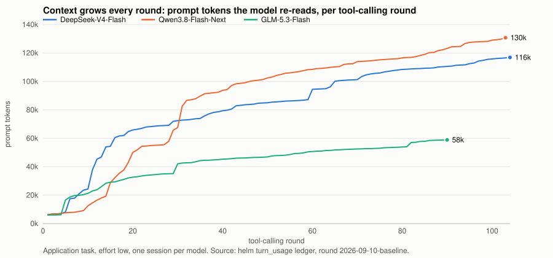
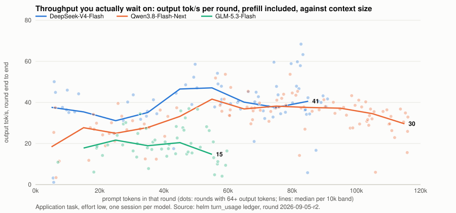

# What real-world throughput looks like

Headline tokens-per-second numbers come from a short prompt and a long,
predictable generation with thinking off. That is the best case for a decode
loop and it is a fair way to compare serving configs. It is not what you wait
on when a model is doing work.

This page shows the same three models on the same two DGX Sparks doing the
application task from `COMPARISON.md`: 62 to 105 tool-calling rounds each,
thinking on, context growing every round as the model reads, edits, builds,
and tests. Every number is read from the agent's per-round ledger for the
round-6 sessions (`results/2026-09-07/`, the current harness); the CSVs are
in `results/2026-09-07/raw/rounds/`, and the round-4 sessions on the previous
harness are in `results/2026-09-05-r2/raw/rounds/` for comparison.

## The shape of a working session

Every round re-reads everything that came before: the system prompt, the
task, every file the model has read, every tool result, every edit, and
(for these three) its own reasoning from earlier in the turn. The context
grows from about 6k tokens on round 1 to 56k (GLM), 145k (Qwen), or 146k
(DeepSeek) by the end. The median round in each session already carries
46k to 104k tokens of context.

That is the number a serving benchmark's prefill row should be read
against: not "how fast is a 16k cold prefill," but "how fast is a 100k
warm one, every eight seconds, for half an hour."

## What you wait on

| per round, application task | DeepSeek-V4-Flash | Qwen3.8-Flash-Next | GLM-5.3-Flash |
|---|---:|---:|---:|
| rounds | 105 | 105 | **62** |
| context, median / final | 98k / 146k | 104k / 145k | 46k / 56k |
| prefix-cache hit rate over the turn | **98.2%** | 94.7% | 93.2% |
| new (uncached) prompt tokens per round, median | **1,013** | 3,960 | 2,606 |
| time to first token, median | **1.6 s** | 2.3 s | 3.2 s |
| output tok/s per round, end to end, median | **36.4** | 32.3 | 20.5 |
| same, on rounds under 20k context | **41.8** | 34.1 | (too few rounds) |
| same, on rounds over 50k context | **36.4** | 32.4 | 18.5 |
| seconds per round, median / p90 | 8.0 / 43 | 9.7 / 54 | **6.4 / 33** |
| rounds longer than a minute | 8 | 10 | **2** |
| output tokens per round, median | 257 | 285 | 108 |
| whole task | 34.5 min | 35.8 min | **14.1 min** |

Three things this table says that a decode benchmark cannot:

**A 146k-token context costs about 10% of throughput, not 5×.** Prefill
alone would say a round carrying 146k tokens is many times more expensive
than one carrying 20k. It is not, because 93 to 98 percent of every prompt
is served from the prefix cache and only the new tokens are prefilled:
DeepSeek's median round adds about a thousand new tokens to a 98k-token
context and still reaches first token in 1.6 seconds. Across the whole
range, throughput falls from about 42 tok/s at small contexts to about
36 at 140k. That decline is real and it is gentle. It is also invisible in
a cold-prefill ladder, which measures the case the cache exists to avoid.

**End-to-end rate is well below the decode headline, and the gap is
model-shaped.** DeepSeek's raw decode peaks near 75 tok/s and its median
working round runs at 36. Qwen's engine is the fastest on this hardware and
its median round is 32, because it carries the largest per-round prompt
(4k new tokens on top of a 104k context) and thinks on every round. GLM's
median round is 20 tok/s: it produces the fewest tokens per round (a median
of 108), so per-request overhead and prefill dominate, and its engine's
prefill is the slowest of the three. GLM still finished first, in 14
minutes, because 62 short rounds beat 105 long ones.

**The long rounds are thinking, not reading.** Each model's slowest rounds
were its planning rounds: DeepSeek's round 15, 215 seconds and 7.8k output
tokens, is where it laid out the application; Qwen's round 22, 147 seconds
and 5.4k tokens, is the same moment in its run; GLM's longest round is 78
seconds. Those rounds are what a "reasoning tok/s" figure would describe,
and they are a handful per session. Most of the other rounds are six to
ten seconds: a short thought, a tool call, a result.

## What changed when tool results stopped being summarised

Round 4 (`results/2026-09-05-r2/`) ran the same task with the same models
at the same effort, on a harness that paraphrased large tool results
through a summarising tier. Round 6 hands them over verbatim under a
window-scaled ceiling. The models read more, and the cost lands almost
entirely on the cache rather than on the clock:

| round 4 → round 6 | DeepSeek | Qwen | GLM |
|---|---|---|---|
| context, median | 64k → **98k** | 76k → **104k** | 41k → 46k |
| context, final | 91k → **146k** | 116k → **145k** | 60k → 56k |
| uncached prompt, whole task | 97k → **184k** | 343k → **509k** | 193k → 180k |
| prefix-cache hit | 97.8% → 98.2% | 95.2% → 94.7% | 94.9% → 93.2% |
| seconds per round, median | 8.6 → 8.0 | 8.0 → 9.7 | 6.2 → 6.4 |
| output tok/s, median | 40.0 → 36.4 | 34.5 → 32.3 | 19.0 → 20.5 |
| rounds | 77 → 105 | 102 → 105 | 93 → **62** |
| whole task | 24.0 → 34.5 min | 27.6 → 35.8 min | 18.4 → **14.1 min** |

DeepSeek's and Qwen's contexts grew by half again and their uncached
prompt roughly doubled, while seconds per round moved by a second or less
in either direction. Whole-task wall did grow, but the reason is rounds,
not round cost: DeepSeek spent 28 extra rounds looking at its own pages
with the new browser tools, and Qwen spent its extra rounds on a longer
survey. GLM read the least of the three on both harnesses, so verbatim
results barely touched it, and it finished a third faster than before.

The practical reading: **on this hardware, letting an agent read whole
files instead of summaries is close to free per round**, as long as the
prefix cache is on and the conversation is append-only. What costs is
deciding to take more turns.

## How to read a headline number after this

- A single-stream decode figure (55 to 75 tok/s here) is the ceiling for
  one round's generation phase. Multiply the round's output by that and
  add the prefill of whatever is new; on a warm cache the second term is
  small.
- A cold-prefill figure tells you what the first round of a fresh
  conversation costs, or what a round costs after the cache is evicted.
  Under load with several users, that matters more than it does here.
- An aggregate figure across 4 or 16 streams tells you how many such
  sessions the box can carry at once, not how any one of them feels.
- What a session feels like is seconds per round: six to ten at the
  median for all three, with a tail of long rounds where the model
  thinks, and a wall of 14 to 36 minutes for a task of 60 to 105 rounds.

## Method

Source: `turn_usage.round_metrics` in the helm ledger, one entry per
model call, with the backend's usage counts (`prompt_tokens`,
`cached_tokens`, `completion_tokens`, `reasoning_tokens` where reported)
and helm's client-side `duration_ms` and `ttft_ms`. Output tok/s per round
is `completion_tokens / duration_ms`, which includes prefill, network, and
the gateway; it is the rate you experience, not the engine's decode rate.
Rounds with fewer than 64 output tokens are excluded from the tok/s
medians. Time to first token is recorded on every Qwen round and on most
of the others (the ledger drops it on some tool-call rounds), so the TTFT
medians for DeepSeek and GLM are over the rounds that have it. The charts
are static SVG, regenerated by `design/tools/realworld_charts.py <round>`;
the CSVs carry every value.
